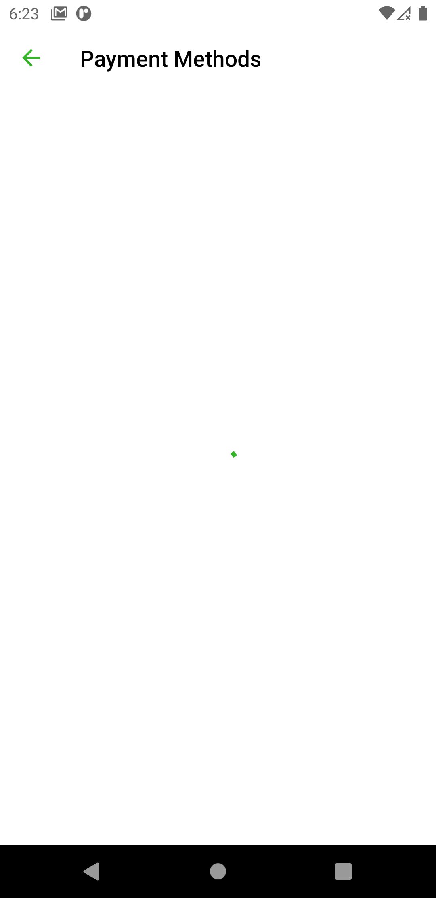

# Payoneerpayment
Home Exercise - Android

# Description
This was a home exercise given by payoneer Germany which consisted of building a Payment Activity mokup for a native android mobile application
with a UI design provided by them.

# Screenshoots

# Technologies Used
  - Java
  - MVVM Architecture
  - RxJava
  - Retrofit
  - Expresso / JUnit
  - Glide
  - Live Data

